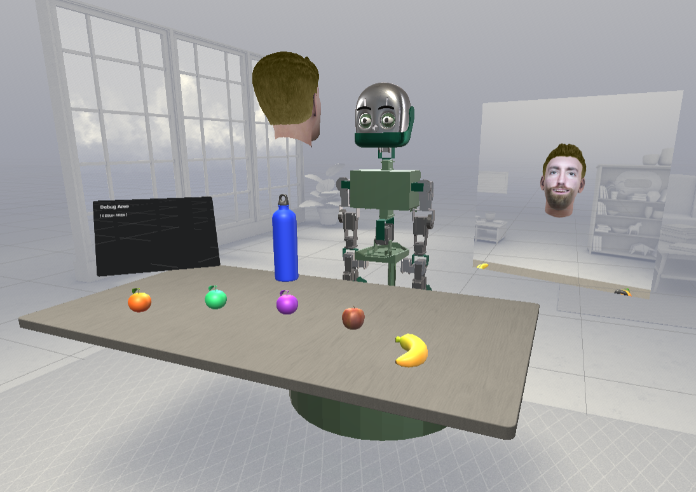
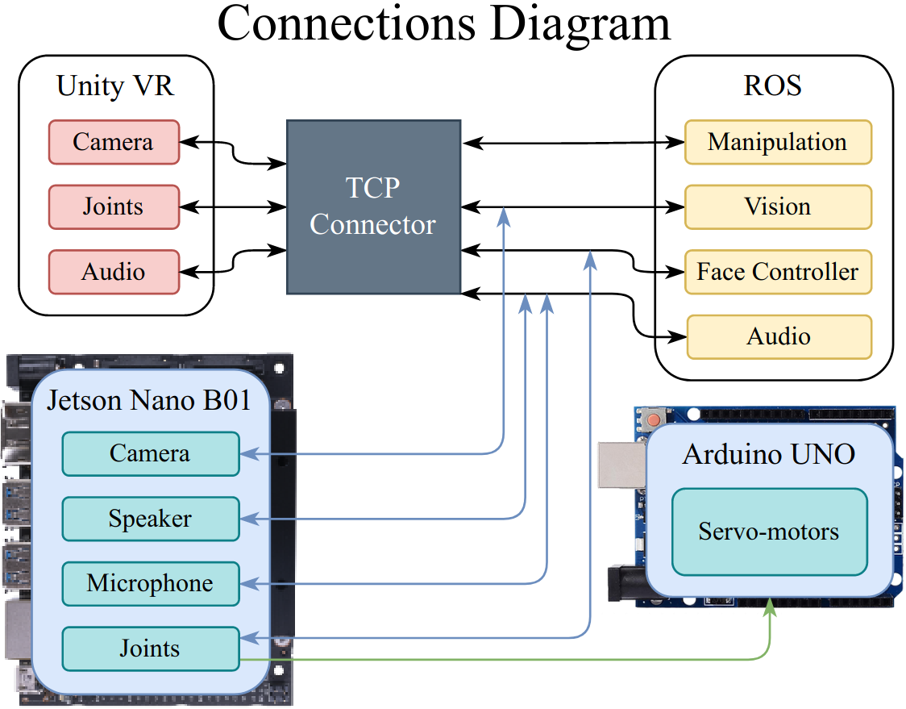

<h2 align="center">Jubileo: An Open-Source Robot and Framework<br/>for Research in Human-Robot Social Interaction</h2>

<p align="center"> 
  
</p>

<p align="center">
  
  
  
  
  
  
  
  
  
  
  
  
</p>
<br/>
 
## Objective
<p align="justify"> 
  <a>Human-robot interaction (HRI) is essential to the widespread use of robots in daily life. Robots will eventually be able to carry out a variety of duties in human civilization through effective social interaction. Creating straightforward and understandable interfaces to engage with robots as they start to proliferate in the personal workspace is essential. Typically, interactions with simulated robots are displayed on screens. A more appealing alternative is virtual reality (VR), which gives visual cues more like those seen in the real world. In this study, we introduce Jubileo, a robotic animatronic face with various tools for research and application development in human-robot social interaction field. Jubileo project offers more than just a fully functional open-source physical robot; it also gives a comprehensive framework to operate with a VR interface, enabling an immersive environment for HRI application tests and noticeably better deployment speed.</a>  
</p>
  

## Setup
<p align="justify"> 
 <a>All of requirements is show in the badgets above, but if you want to install all of them, enter the repository and execute the following line of code:</a>
</p>

```shell
pip3 install -r requirements.txt
```

We strongly recommend using the package with the pre-configured <a href="https://hub.docker.com/repository/docker/jajaguto/jubileo">docker image</a>. Don't forget to use the <a href="https://docs.nvidia.com/datacenter/cloud-native/container-toolkit/install-guide.html#docker">nvidia container toolkit</a>  to enable GPU usage within docker. 

Note: depending on the speed of your internet connection this can take a long time. 

## VR Simulation

You can download the 3D models to 3D print the animatronic face, or download the URDF of Jubileo to use in any simulation platform at <a href='https://github.com/JajaGuto/jubileo_models'>this</a> repository.

## VR Simulation

You can download and configure the Jubileo's VR HRI framework at <a href='https://github.com/JajaGuto/vr_hri_framework'>this</a> repository.

## Structure
<p align="justify"> 
The ROS packages developed for the Jubileo framework aim to provide researchers with a complete base of algorithms that enriches the robot's capabilities, such as computer vision, speech recognition, and robot joint control. The framework provides a ROS structure that is compatible with both the real and the simulated robot. A simplified overview of the Jubileo's ROS connection nodes is present in image bellow. 
</p>

<p align="center"> 
  
</p>

## Results

<p align="center"> 
  
</p>

See more about the results in the [YouTube video](https://youtu.be/JuxAU4nFGbk).

<p align="center"> 
  <i>If you liked this repository, please don't forget to starred it!</i>
  
</p>
