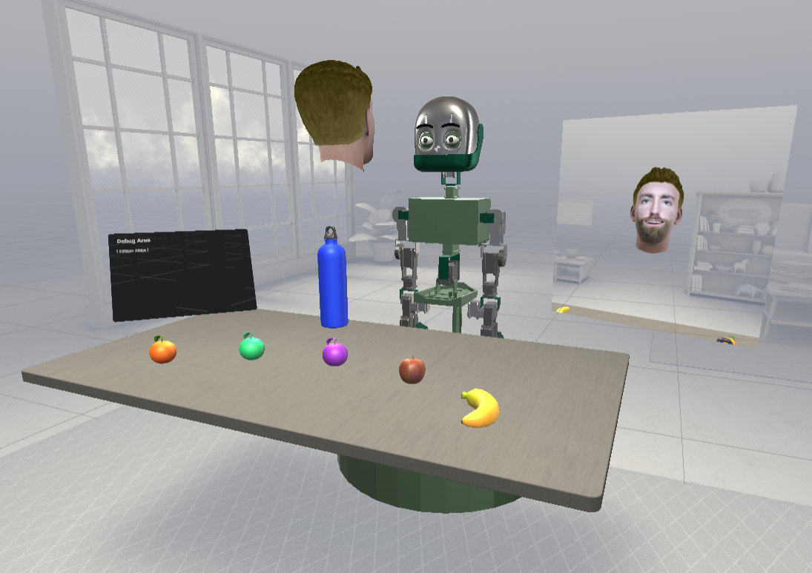
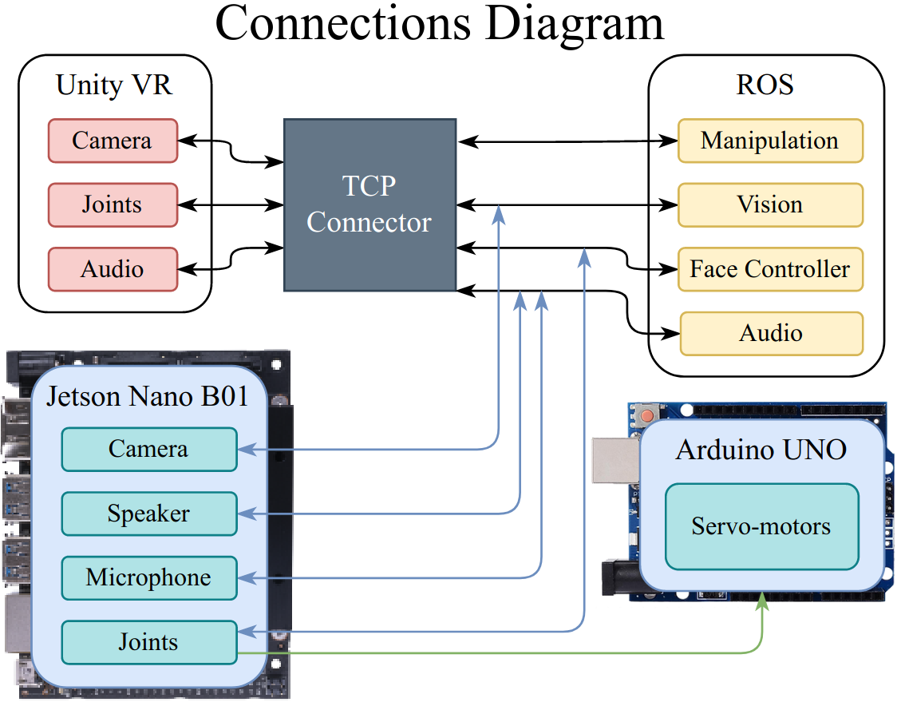

<h2 align="center">Jubileo: An Open-Source Robot and Framework<br/>for Research in Human-Robot Social Interaction</h2>

<p align="center"> 
  
</p>

<p align="center">
  
  
  
  
  
</p>

## Overview

Jubileo is an open-source animatronic robot face and software framework created for research in human-robot social interaction (HRI). The project combines a physical robot, ROS 2 nodes, perception and interaction modules, and a virtual-reality interface that can be used to prototype and evaluate social-robot applications before deployment on the real platform.

The repository was developed as a research prototype and contains code used during the original Jubileo experiments. Some dependencies and API integrations reflect the software stack available at that time, so users may need to adapt package versions for newer ROS 2 or Python environments.

## Main capabilities

- ROS 2-based control and communication between Jubileo components.
- Computer-vision and face-related interaction modules.
- Speech generation through Google Cloud Text-to-Speech.
- LLM-based conversational and educational mini-games.
- Support for both the physical robot and the VR HRI environment.
- Separate repositories for printable/URDF models and the VR framework.

## Installation

Install the Python dependencies from the repository root:

```shell
pip3 install -r requirements.txt
```

For the original environment, a pre-configured Docker image is also available:

https://hub.docker.com/repository/docker/jajaguto/jubileo

GPU-enabled Docker setups may additionally require the NVIDIA Container Toolkit.

## API keys and local configuration

**Do not commit API keys or other credentials to this repository.**

Some legacy ROS nodes read the OpenAI key from a local `config.json` file. A safe template is provided as `config.example.json`:

```shell
cp config.example.json config.json
```

Then replace the placeholder locally with your own key. `config.json` is ignored by Git and should never be committed.

Legacy standalone scripts now read credentials from environment variables instead:

```shell
export OPENAI_API_KEY="your-key-here"
export GOOGLE_API_KEY="your-key-here"
```

For long-term deployments, prefer a secrets manager or another secure runtime configuration mechanism instead of storing credentials in source files.

## URDF and 3D models

The printable 3D models and Jubileo URDF are maintained in the [jubileo_models](https://github.com/JajaGuto/jubileo_models) repository.

## VR simulation

The VR-based HRI framework is available in the [vr_hri_framework](https://github.com/JajaGuto/vr_hri_framework) repository.

## Software structure

The ROS packages developed for Jubileo provide a common base for perception, speech, interaction, and robot-joint control. The same overall architecture was designed to support both the physical platform and the simulated/VR environment.

<p align="center"> 
  
</p>

## Demonstration

<p align="center"> 
  
</p>

A demonstration of the project is available on [YouTube](https://youtu.be/JuxAU4nFGbk).

## Security note

Older revisions of this research repository contained credentials directly in source/configuration files. Those credentials should be considered compromised and must remain revoked. Current code should use only local configuration or environment variables, and generated build artifacts should not be committed.

## Related repositories

- [jubileo_models](https://github.com/JajaGuto/jubileo_models) — URDF and printable 3D models.
- [vr_hri_framework](https://github.com/JajaGuto/vr_hri_framework) — VR environment for HRI experiments.

<p align="center"> 
  <i>If this project is useful to you, consider starring the repository.</i><br/>
  
</p>
